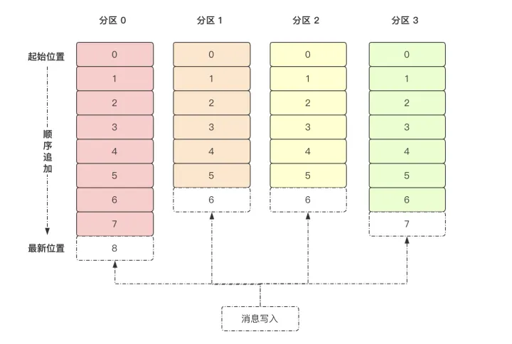

# Kafka的基本使用


前面几个章节我们学习了Kafka的前世今生，今天我们就来学习它的基本使用吧！

要学习基本使用，就必须先得搭建一套环境，那么今天我们就来使用Docker来安装Kafka吧！

当然，在安装Kafka之前，先必须安装Zookeeper！
```shell
docker run --name zookeeper -p 2181:2181  wurstmeister/zookeeper
```

Zookeeper安装完成之后，就来安装Kafka吧！
```shell
docker run --name kafka -p 9092:9092 -e KAFKA_BROKER_ID=0 -e KAFKA_ZOOKEEPER_CONNECT=zookeeper:2181 --link zookeeper -e KAFKA_ADVERTISED_LISTENERS=PLAINTEXT://192.168.1.60(机器IP):9092 -e KAFKA_LISTENERS=PLAINTEXT://0.0.0.0:9092 -t wurstmeister/kafka
```

安装完成之后，进入Kafka容器，查看命令是否存在：
```shell
docker exec -it kafka sh
cd /opt/kafka_2.13-2.8.1/bin/
ls -l
```
我们可以看到Kafka有如下的命令脚本：
```shell
-rwxr-xr-x 1 root root  1423 Sep 14  2021 connect-distributed.sh
-rwxr-xr-x 1 root root  1396 Sep 14  2021 connect-mirror-maker.sh
-rwxr-xr-x 1 root root  1420 Sep 14  2021 connect-standalone.sh
-rwxr-xr-x 1 root root   861 Sep 14  2021 kafka-acls.sh
-rwxr-xr-x 1 root root   873 Sep 14  2021 kafka-broker-api-versions.sh
-rwxr-xr-x 1 root root   860 Sep 14  2021 kafka-cluster.sh
-rwxr-xr-x 1 root root   864 Sep 14  2021 kafka-configs.sh
-rwxr-xr-x 1 root root   945 Sep 14  2021 kafka-console-consumer.sh
-rwxr-xr-x 1 root root   944 Sep 14  2021 kafka-console-producer.sh
-rwxr-xr-x 1 root root   871 Sep 14  2021 kafka-consumer-groups.sh
-rwxr-xr-x 1 root root   948 Sep 14  2021 kafka-consumer-perf-test.sh
-rwxr-xr-x 1 root root   871 Sep 14  2021 kafka-delegation-tokens.sh
-rwxr-xr-x 1 root root   869 Sep 14  2021 kafka-delete-records.sh
-rwxr-xr-x 1 root root   866 Sep 14  2021 kafka-dump-log.sh
-rwxr-xr-x 1 root root   863 Sep 14  2021 kafka-features.sh
-rwxr-xr-x 1 root root   870 Sep 14  2021 kafka-leader-election.sh
-rwxr-xr-x 1 root root   863 Sep 14  2021 kafka-log-dirs.sh
-rwxr-xr-x 1 root root   873 Sep 14  2021 kafka-metadata-shell.sh
-rwxr-xr-x 1 root root   862 Sep 14  2021 kafka-mirror-maker.sh
-rwxr-xr-x 1 root root   886 Sep 14  2021 kafka-preferred-replica-election.sh
-rwxr-xr-x 1 root root   959 Sep 14  2021 kafka-producer-perf-test.sh
-rwxr-xr-x 1 root root   874 Sep 14  2021 kafka-reassign-partitions.sh
-rwxr-xr-x 1 root root   874 Sep 14  2021 kafka-replica-verification.sh
-rwxr-xr-x 1 root root 10329 Sep 14  2021 kafka-run-class.sh
-rwxr-xr-x 1 root root  1376 Sep 14  2021 kafka-server-start.sh
-rwxr-xr-x 1 root root  1361 Sep 14  2021 kafka-server-stop.sh
-rwxr-xr-x 1 root root   860 Sep 14  2021 kafka-storage.sh
-rwxr-xr-x 1 root root   945 Sep 14  2021 kafka-streams-application-reset.sh
-rwxr-xr-x 1 root root   863 Sep 14  2021 kafka-topics.sh
-rwxr-xr-x 1 root root   958 Sep 14  2021 kafka-verifiable-consumer.sh
-rwxr-xr-x 1 root root   958 Sep 14  2021 kafka-verifiable-producer.sh
-rwxr-xr-x 1 root root  1714 Sep 14  2021 trogdor.sh
drwxr-xr-x 2 root root  4096 Sep 14  2021 windows
-rwxr-xr-x 1 root root   867 Sep 14  2021 zookeeper-security-migration.sh
-rwxr-xr-x 1 root root  1393 Sep 14  2021 zookeeper-server-start.sh
-rwxr-xr-x 1 root root  1366 Sep 14  2021 zookeeper-server-stop.sh
-rwxr-xr-x 1 root root  1019 Sep 14  2021 zookeeper-shell.sh
```
这就说明我们已经完成了Kafka的安装，接下来我们就要学习一些Kafka的基本使用啦！

## 创建Topic

接下来我们创建一个`test`的Topic，这个Topic只有一个partition，并且备份因子也为1：
```shell
./kafka-topics.sh --create --zookeeper zookeeper:2181 --replication-factor 1 --partitions 1 --topic test
=>Created topic test.
```

当然，你还可以通过这个命令来查看当前Kafka里面有哪些Topic：
```shell
./kafka-topics.sh --list --zookeeper zookeeper:2181
=> test
```

### 主题(Topic)与分区(Partition)

上面创建主题的命令中，参数中提到了主题和分区。Kafka 中的消息以主题为单位进行归类，生产者负责将消息发送到特定的主题（发送到 Kafka集群中的每一条消息都要指定一个主题），而消费者负责订阅主题并进行消费。

主题可以理解为一个类别的名称，是一个逻辑上的概念，它还可以细分为多个分区，一个分区只属于单个主题，很多时候也会把分区称为主题分区（Topic-Partition）。同一主题下的不同分区包含的消息是不同的，分区在存储层面可以看作一个可追加的日志（Log）文件，消息在被追加到分区日志文件的时候都会分配一个特定的偏移量（offset）。

所以，Partition将一个Topic中的消息分区来存储，这样的好处有多个：
* 分区存储，可以解决统一存储文件过大的问题。
* 提供了读写的吞吐量，读和写可以同时在多个分区中进行。



offset 是消息在分区中的唯一标识，Kafka 通过它来保证消息在分区内的顺序性，不过 offset 并不跨越分区，也就是说，Kafka 保证的是分区有序而不是主题有序。

每个Consumer会定期将自己消费分区的offset提交给kafka内部topic:_consumer_offsets, 提交过去的时候，key是consumerGroupId + Topic + 分区号，value就是当前的offset值。kafka会定期清理topic里面的消息，最后就保留最新的那条数据。

因为_consumer_offsets可能会接受高并发的请求，kafka默认给其分配50个分区，这样可以通过增加机器的方式增加并发。

Kafka 为分区引入了多副本（Replica）机制，通过增加副本数量可以提升容灾能力。

同一分区的不同副本中保存的是相同的消息（在同一时刻，副本之间并非完全一样），副本之间是“一主多从”的关系，其中leader副本负责处理读写请求，follower副本只负责与leader副本的消息同步。副本处于不同的broker中，当leader副本出现故障时，从 follower 副本中重新选举新的leader副本对外提供服务。Kafka 通过多副本机制实现了故障的自动转移，当 Kafka 集群中某个 broker 失效时仍然能保证服务可用。

## 生产与消费消息

### 发送消息
Kafka自带了一个Producer命令客户端，可以从本地文件读取内容，或者我们可以以命令行中直接输入内容，并将这些内容以消息的形式发送到Kafka集群中，在默认情况下，每一行会被当做一个独立的消息，命令如下：
```shell
./kafka-console-producer.sh --broker-list localhost:9092 --topic test
>zhangsan
>lis
>eason
>...
```

### 消费消息
对于Consumer，Kafka同样也携带了一个命令行客户端，会将获取到的消息在命令中进行输出，默认是最新的消息。命令如下：
```shell
./kafka-console-consumer.sh --bootstrap-server localhost:9092 --topic test
```

当然，Kafka保存了消息的历史，所以如果消费者需要从头消费，只需要加上下面的参数即可：
```shell
./kafka-console-consumer.sh --bootstrap-server localhost:9092 --topic test --from-beginning
==>
zhangsan
lis
eason
```

从上面的命令可以看出，Kafka对消息是进行存储的，而且是有顺序的，所以在进行消费的时候可以指明偏移量进行消费！

## 单播与多播消息
如果多个消费者在一个消费组，那么只有一个消费者可以接受到订阅的Topic中的消息，换言之，同一个消费组中只能有一个消费者收到一个Topic中的消息。
我们可以在创建消费者的时候，指定消费组：
```shell
./kafka-console-consumer.sh --bootstrap-server localhost:9092 --topic test --consumer-property group.id=testGroup
```

但是，对于不同的消费组订阅同一个Topic，那么不同的消费组中只有一个消息消费者能收到消息，所以，如果需要实现多播消息，那么消费者就必须在不同的消费组中。

可以通过如下的命令来查看消费组及其相关信息：
```shell
./kafka-consumer-groups.sh --bootstrap-server localhost:9092 --list
=>testGroup
```
也可以通过下面的命令来查看消费组中的具体信息，比如偏移量，堆叠的消息数量等：
```shell
./kafka-consumer-groups.sh --bootstrap-server localhost:9092 --describe --group testGroup
=> 
GROUP           TOPIC           PARTITION  CURRENT-OFFSET  LOG-END-OFFSET  LAG             CONSUMER-ID                                               HOST            CLIENT-ID
testGroup       test            0          5               5               0               consumer-testGroup-1-417ad73d-87ac-406e-90b4-2c31d56a7168 /172.17.0.1     consumer-testGroup-1
```
上面的命令中，列名表示如下：
* CURRENT-OFFSET：当前消费组的以消费便宜量。
* LOG-END-OFFSET：主题对应消息的结束偏移量。
* LAG：当前消费组未消费的消息数。