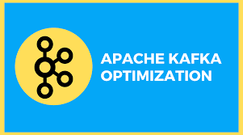

# Kafka 常见问题与优化策略

虽然，Kafka作为一款消息中间件已经是非常优秀了，但是在一些场景中，我们需要有一些正对性的优化和调整，下面我们就来看看Kafka常见的问题处理方案和优化策略。

## 防止消息丢失

Kafka是有生产者，消费者和Broker组成，为了保证数据不被丢失，需要：
* 生产者：尽量使用同步发送，把ACK设置为1或ALL，尽量设置同步分区数>=2.
* 消费者：把自动提交改为手动提交。

## 防止消息的重复消费

有时候，在生产者发送完消息后，因为网络抖动，没有收到ACK，但实际上Broker已经收到了，此时，生产者会进行重试，于是Broker就会收到多条相同的消息，进而造成消费者的重复消费。

如果为了消息的不重复消费，而把生产端的重试机制关闭，消费端的手动提交改为自动提交，这样反而会出现消息丢失，不推荐使用。所以，我们可以转换思路，在消费者端进行幂等判断，就能解决消息的重复消费问题。通常有两种解决方法：

* 在数据库中创建联合主键，防止相同的主键创建出多条记录。
* 使用分布式锁，以业务ID为锁，保证只有一条记录能够被成功创建。

## 消息的顺序消费

我们知道，位于Kafka在一个消费组里面的消费者是不能保证消息消费的顺序性的，所以我们通常有以下做法：

* 生产者：在发送时将ACK不能设置为0，关闭重试，使用同步发送，等到发送成功在发下一条，确保消息是顺序发送的。
* 消费者：消息是发送到一个分区中，只能有一个消费组的消息来接收消息。

需要注意的是：Kafka的顺序消费消息会牺牲掉性能。

## 消费积压问题

当消息的消费者的消费速度远远赶不上生产者生产消息的速度，导致kafka中有大量的消息没有被消费，随着没有被消费的数据堆积越多，消费者寻址的性能会越来越差，最后导致整个Kafka对外提供服务的性能很差，从而造成其他服务访问速度很慢，进而造成服务雪崩。

通常有如下的解决方案：

* 在消费者中，使用多线程，充分利用机器的性能进行消费消息。
* 通过业务架构设计，提升业务层面消费的性能。
* 创建多个消费组，多个消费者，部署到其他机器上，一起消费，提高消费者的消费速度。

## 延迟队列

在有些情况下，比如火车票预订后需要30min内付款，负责取消该订单。这种场景通常可以使用延迟队列来做。

然而kafka本身没有提供延迟队列的实现方式，经常需要我们自己曲线救国：
* 创建多个Topic，每个topic表示延时的时间间隔。比如topic-5s、topic-10min等。
* 消息生产者发送消息到制定的topic上面，并带上消息的发送时间。
* 消费者通过轮询的方式，每个一定的时间间隔从该主题中拉取消息。
  * 如果当前时间和消息的创建时间相比超过制定的延时时间，就去数据库中修改订单状态为已取消。
  * 如果当前时间和消息的创建时间相比没有超过制定的延时时间，就记录当前的Offset，并不在消费之后的消息，等待一定的时间间隔，再次向Kafka拉取Offset之后的消息，继续进行判断，依次反复进行。

