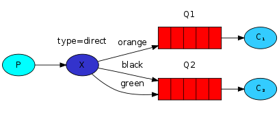

# RabbitMQ的工作模式

RabbitMQ官方推出了6中工作模式，常用的工作模式有5中，这五种工作模式在实际开发中使用非常广泛，今天我们就来了解一下！

## 1. "Hello World!" 简单模式

这是一种最简单的工作模式，当然也是最常用的模式，消息产生消息放入队列，消息的消费者(consumer) 监听(while) 消息队列,如果队列中有消息,就消费掉,消息被拿走后,自动从队列中删除。

当然，这种模式可能存在一个隐患，消息可能没有被消费者正确处理,已经从队列中消失了,造成消息的丢失，这里可以设置成手动的ack,但如果设置成手动ack，处理完后要及时发送ack消息给队列，否则会造成内存溢出。

## 2. Work queues 工作模式

在这种模式下，消息产生者将消息放入队列， 消费者可以有多个, 多个消费者同时监听同一个队列,消息被消费。多个消费者共同争抢当前的消息队列内容,谁先拿到谁负责消费消息。

这种模式常见的应用场景是：对于任务较重或者较多的情况，可以提高并发处理的速度。

可能存在的隐患，高并发情况下,默认会产生某一个消息被多个消费者共同使用,可以在业务上加锁或者使用幂等操作来避免重复消费。

## 3. Publish/Subscribe 发布订阅模式

在发布订阅模式中，多了一个角色X，这个角色叫做Exchange，而且过程也有所变化。

此时，生产者不在直接发送消息到队列里面，而是发给Exchange，Exchange收到消息之后，根据自己的种类不同，将消息交给某个队列，或者是丢弃。到底是如何操作，取决于Exchange的类型：
* Fanout：广播，将消息交给所有绑定到交换机的队列。
* Direct：定向，吧消息交给符合制定Routing key的队列。
* Topic：通配符，吧消息交给符合Routing Pattern的队列。

需要注意的是，Exchange只负责转发消息，不具备消息的储存能力，因此如果没有任何队列与Exchange绑定，或者没有符合的路由规则，那么消息会被丢失。

## 4. Routing 路由模式

在这种模式下，队列与交换机的绑定，不再是任意的绑定了，而是在绑定的时候，指定一个Routing Key。

消息的生产者发送消息时，携带路由Key，Exchange将更加路由规则，找到对应的队列，将消息转发给制定的队列即可。

将消息任务扔到对应的队列中业务场景在实际开发中也比较常见，比如更加Log的级别进行分类，交给不同的消息队列去处理。

## 5. Topics 主题模式

本质上来说，这种模式也是路由模式的一种，这是使用通配符让其更加灵活而已。

消息产生者产生消息, 把消息交给交换机，交换机根据key的规则模糊匹配到对应的队列,由队列的监听消费者接收消息消费。

通常模糊匹配字符串有两个：（*）星号代表能够匹配多个单词的通配符，#(井号)代表仅能匹配一个单子的通配符。

所以，主题模式可以实现Pub/Sub、Routing的所有功能，同时比他们两个提供了更加灵活的配置，当然，这种配置也是有代价的，会牺牲交换机的性能。